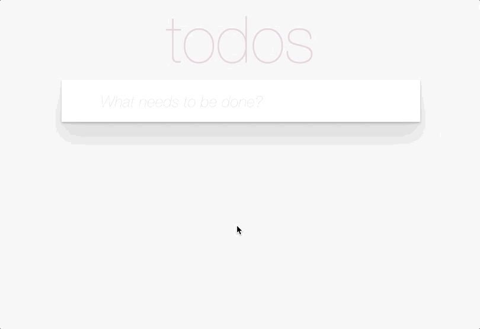
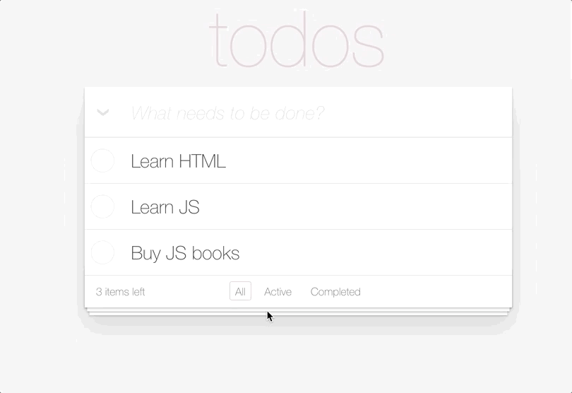

# ToDo App

👀 [DEMO LINK](https://sheva10barca.github.io/todo-app-react/)

Implemented a TODO app working as described below.

The app state is saved to the `localStorage`.

## List of technologies:
- React
- Typescript
- CSS
